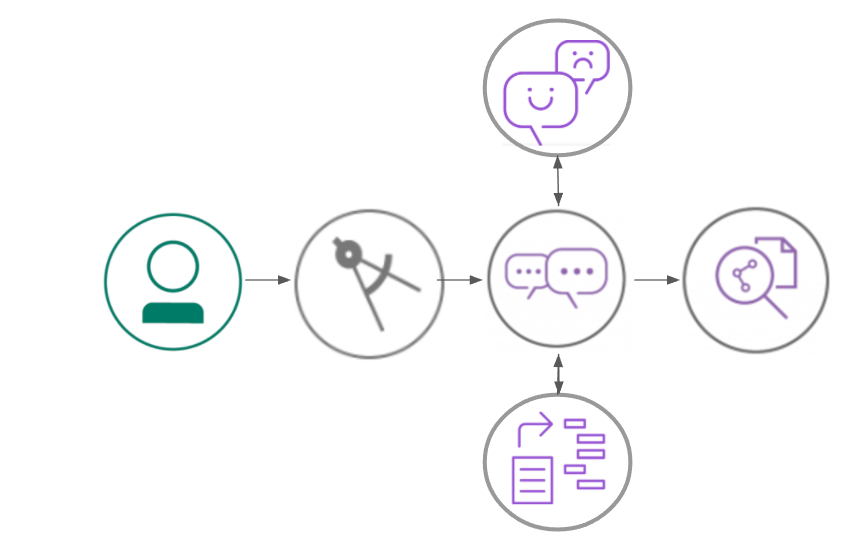
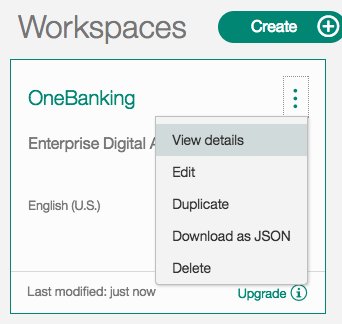

[](https://travis-ci.org/IBM/watson-banking-chatbot)


# Create a banking chatbot with FAQ discovery, anger detection and natural language understanding
In this developer journey, we will create a chatbot using Node.js and Watson Conversation. The Conversation flow will be enhanced by using Natural Language Understanding to identify entities and using Tone Analyzer to detect customer emotions. For FAQs, a call to the Discovery service will use passage retrieval to pull answers from a collection of documents.

When the reader has completed this journey, they will understand how to:

* Create a chatbot that converses via a web UI using Watson Conversation and Node.js
* Use Watson Discovery with passage retrieval to find answers in FAQ documents
* Use Watson Tone Analyzer to detect emotion in a conversation
* Identify entities with Watson Natural Language Understanding



### With Watson

Want to take your Watson app to the next level? Looking to leverage Watson Brand assets? Join the [With Watson](https://www.ibm.com/watson/with-watson) program which provides exclusive brand, marketing, and tech resources to amplify and accelerate your Watson embedded commercial solution.

## Included components

* [IBM Watson Conversation](https://www.ibm.com/watson/developercloud/conversation.html): Build chatbots that understand natural language and deploy them on messaging platforms and websites, on any device.
* [IBM Watson Discovery](https://www.ibm.com/watson/developercloud/discovery.html): Rapidly build a cognitive search and content analytics engine.
* [IBM Watson Natural Language Understanding](https://www.ibm.com/watson/developercloud/natural-language-understanding.html): Natural language processing for advanced text analysis.
* [IBM Watson Tone Analyzer](https://www.ibm.com/watson/developercloud/speech-to-text.html): Understand tone and style in written text.

## Featured technologies
* [Node.js](https://nodejs.org/): An asynchronous event driven JavaScript runtime, designed to build scalable applications.

# Steps

Use the ``Deploy to Bluemix`` button **OR** create the services and run locally.

## Deploy to Bluemix
[](https://bluemix.net/deploy?repository=https://github.com/IBM/watson-banking-chatbot.git)

1. Press the above ``Deploy to Bluemix`` button and then click on ``Deploy``.

2. In Toolchains, click on Delivery Pipeline to watch while the app is deployed. Once deployed, the app can be viewed by clicking 'View app'.


3. To see the app and services created and configured for this journey, use the Bluemix dashboard. The app is named `watson-banking-chatbot` with a unique suffix. The following services are created and easily identified by the `wbc-` prefix:
    * wbc-conversation-service
    * wbc-discovery-service
    * wbc-natural-language-understanding-service
    * wbc-tone-analyzer-service

## Run locally
> NOTE: These steps are only needed when running locally instead of using the ``Deploy to Bluemix`` button.

1. [Clone the repo](#1-clone-the-repo)
2. [Create Watson services with IBM Bluemix](#2-create-watson-services-with-ibm-bluemix)
3. [Import the Conversation workspace](#3-import-the-conversation-workspace)
4. [Load the Discovery documents](#4-load-the-discovery-documents)
5. [Configure credentials](#5-configure-credentials)
5. [Run the application](#6-run-the-application)

### 1. Clone the repo

Clone the `watson-banking-chatbot` locally. In a terminal, run:

```
$ git clone https://github.com/IBM/watson-banking-chatbot
```

We’ll be using the file [`data/WCS/workspace-ConversationalBanking.json`](data/WCS/workspace-ConversationalBanking.json) and the folder
[`data/WCS/`](data/WCS/)

### 2. Create Watson services with IBM Bluemix

Create the following services:

* [**Watson Conversation**](https://console.ng.bluemix.net/catalog/services/conversation)
* [**Watson Discovery**](https://console.ng.bluemix.net/catalog/services/discovery)
* [**Watson Tone Analyzer**](https://console.ng.bluemix.net/catalog/services/tone-analyzer)
* [**Watson Natural Language Understanding**](https://console.ng.bluemix.net/catalog/services/natural-language-understanding)

### 3. Import the Conversation workspace

Launch the **Watson Conversation** tool. Use the **import** icon button on the right

<p align="center">
  
</p>

Find the local version of [`data/WCS/workspace-ConversationalBanking.json`](data/WCS/workspace-ConversationalBanking.json) and select
**Import**. Find the **Workspace ID** by clicking on the context menu of the new
workspace and select **View details**. Save this ID for later.

<p align="center">
  
</p>

*Optionally*, to view the conversation dialog select the workspace and choose the
**Dialog** tab, here's a snippet of the dialog:


### 4. Load the Discovery documents

Launch the **Watson Discovery** tool. Create a **new data collection**
and give the data collection a unique name.


> Save the **environment_id** and **collection_id** for your `.env` file in the next step.

Under `Add data to this collection` use `Drag and drop your documents here or browse from computer` to seed the content with the five documents in `data/discovery/docs`.

### 5. Configure credentials

The credentials for Bluemix services (Conversation, Discovery, Tone Analyzer and
Natural Language Understanding), can be found in the ``Services`` menu in Bluemix,
by selecting the ``Service Credentials`` option for each service.

The other settings for Conversation and Discovery were collected during the
earlier setup steps (DISCOVERY_COLLECTION_ID, DISCOVERY_ENVIRONMENT_ID and
WORKSPACE_ID).

Copy the [`env.sample`](env.sample) to `.env`.

```
$ cp env.sample .env
```
Edit the `.env` file with the necessary settings.

`env.sample:`

```
# Replace the credentials here with your own.
# Rename this file to .env before starting the app.

# Watson conversation
CONVERSATION_USERNAME=<add_conversation_username>
CONVERSATION_PASSWORD=<add_conversation_password>
WORKSPACE_ID=<add_conversation_workspace>

# Watson Discovery
DISCOVERY_USERNAME=<add_discovery_username>
DISCOVERY_PASSWORD=<add_discovery_password>
DISCOVERY_ENVIRONMENT_ID=<add_discovery_environment>
DISCOVERY_COLLECTION_ID=<add_discovery_collection>

# Watson Natural Language Understanding
NLU_USERNAME=<add_nlu_username>
NLU_PASSWORD=<add_nlu_password>

# Watson Tone Analyzer
TONE_ANALYZER_USERNAME=<add_tone_analyzer_username>
TONE_ANALYZER_PASSWORD=<add_tone_analyzer_password>
```


### 6. Run the application
1. Install [Node.js](https://nodejs.org/en/) runtime or NPM.
1. Start the app by running `npm install`, followed by `npm start`.
1. Use the chatbot at `localhost:3000`.
> Note: server host can be changed as required in server.js

## Flow
* Answers important FAQs queries from the multiple domains such as across business lines of Loans, Account Opening, Market Place & Digital Banking of Banking industry.
* Also the chatbot solves transactional queries such as view transactions, balances, pay utility bills etc.

* The user writes a query about a service to the chatbot
* The orchestrator accepts query, saves the user context & starts a REST call with the Cognitive APIs.
* Depending on the nature of the query (long /Short tail), the answer is provided by either Watson Conversation API or Watson Retrieve and Rank
* Further to answering user queries, the agent can also be connected to Third party APIs such as India Stack(Aadhaar) for authentication required for verifying identify, e-sign, purchases etc. ;language translation APIs for localization.
* Orchestrator can be further exposed to enterprise systems such as CRM, warehouses, ERP etc. for contextual content.

# License
[Apache 2.0](LICENSE)

# Privacy Notice
If using the `Deploy to Bluemix` button some metrics are tracked, the following
information is sent to a [Deployment Tracker](https://github.com/IBM-Bluemix/cf-deployment-tracker-service) service
on each deployment:

* Node.js package version
* Node.js repository URL
* Application Name (`application_name`)
* Application GUID (`application_id`)
* Application instance index number (`instance_index`)
* Space ID (`space_id`)
* Application Version (`application_version`)
* Application URIs (`application_uris`)
* Labels of bound services
* Number of instances for each bound service and associated plan information

This data is collected from the `package.json` file in the sample application and the `VCAP_APPLICATION` and `VCAP_SERVICES` environment variables in IBM Bluemix and other Cloud Foundry platforms. This data is used by IBM to track metrics around deployments of sample applications to IBM Bluemix to measure the usefulness of our examples, so that we can continuously improve the content we offer to you. Only deployments of sample applications that include code to ping the Deployment Tracker service will be tracked.

## Disabling Deployment Tracking

To disable tracking, simply remove ``require("cf-deployment-tracker-client").track();`` from the ``app.js`` file in the top level directory.

```


### 6. Run the application
1. Install [Node.js](https://nodejs.org/en/) runtime or NPM.
1. Start the app by running `npm install`, followed by `npm start`.
1. Use the chatbot at `localhost:3000`.
> Note: server host can be changed as required in server.js

## Flow
* Answers important FAQs queries from the multiple domains such as across business lines of Loans, Account Opening, Market Place & Digital Banking of Banking industry.
* Also the chatbot solves transactional queries such as view transactions, balances, pay utility bills etc.

* The user writes a query about a service to the chatbot
* The orchestrator accepts query, saves the user context & starts a REST call with the Cognitive APIs.
* Depending on the nature of the query (long /Short tail), the answer is provided by either Watson Conversation API or Watson Retrieve and Rank
* Further to answering user queries, the agent can also be connected to Third party APIs such as India Stack(Aadhaar) for authentication required for verifying identify, e-sign, purchases etc. ;language translation APIs for localization.
* Orchestrator can be further exposed to enterprise systems such as CRM, warehouses, ERP etc. for contextual content.

# License
[Apache 2.0](LICENSE)

# Privacy Notice
If using the `Deploy to Bluemix` button some metrics are tracked, the following
information is sent to a [Deployment Tracker](https://github.com/IBM-Bluemix/cf-deployment-tracker-service) service
on each deployment:

* Node.js package version
* Node.js repository URL
* Application Name (`application_name`)
* Application GUID (`application_id`)
* Application instance index number (`instance_index`)
* Space ID (`space_id`)
* Application Version (`application_version`)
* Application URIs (`application_uris`)
* Labels of bound services
* Number of instances for each bound service and associated plan information

This data is collected from the `package.json` file in the sample application and the `VCAP_APPLICATION` and `VCAP_SERVICES` environment variables in IBM Bluemix and other Cloud Foundry platforms. This data is used by IBM to track metrics around deployments of sample applications to IBM Bluemix to measure the usefulness of our examples, so that we can continuously improve the content we offer to you. Only deployments of sample applications that include code to ping the Deployment Tracker service will be tracked.

## Disabling Deployment Tracking

To disable tracking, simply remove ``require("cf-deployment-tracker-client").track();`` from the ``app.js`` file in the top level directory.
