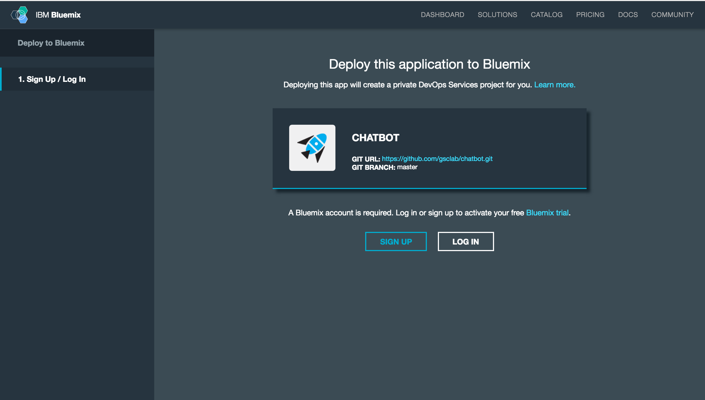
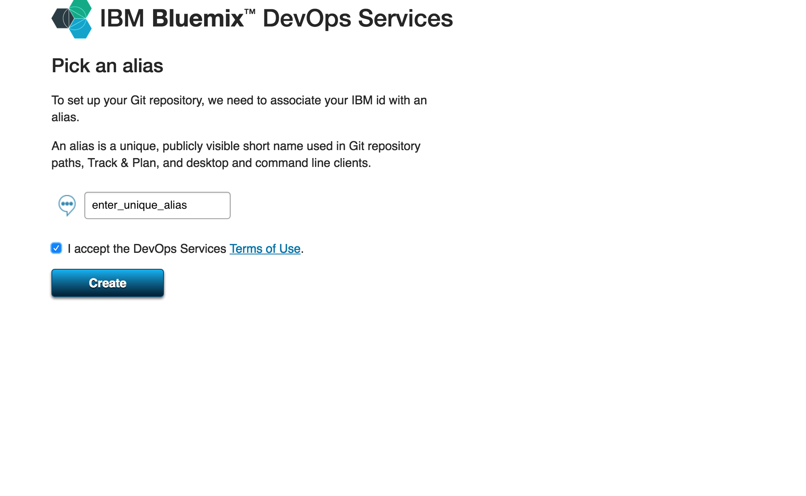
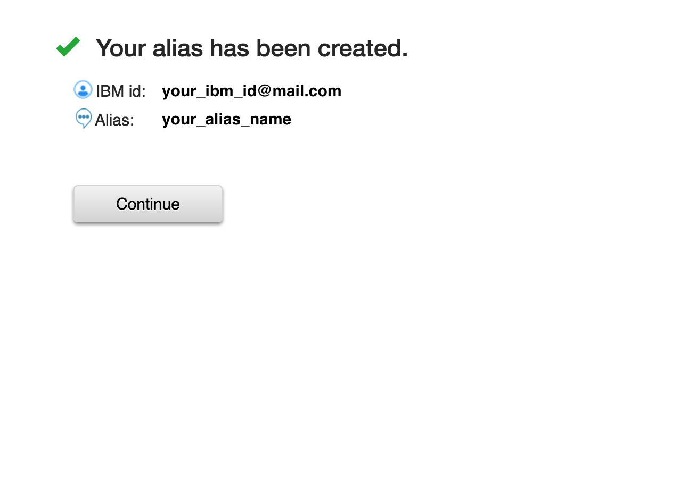
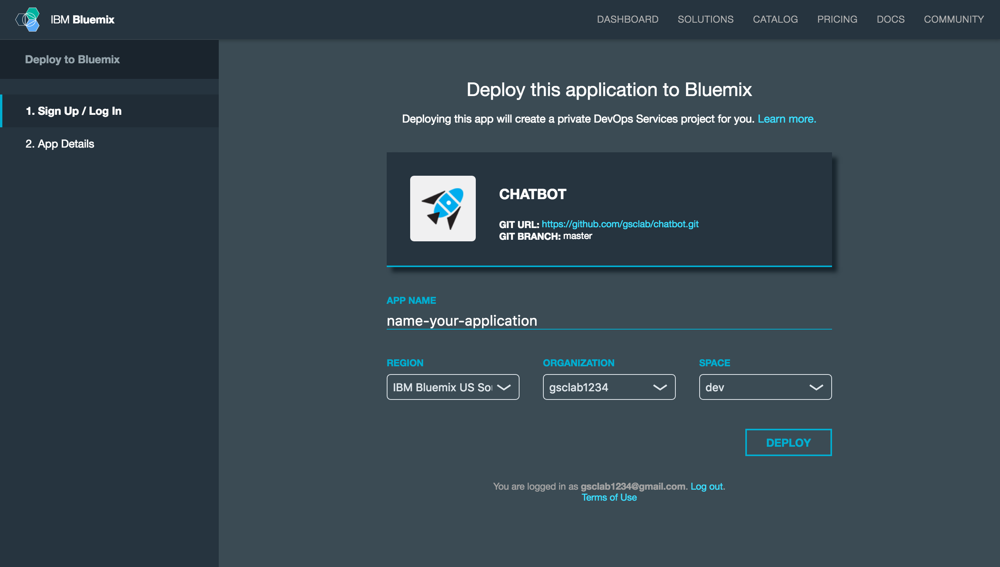
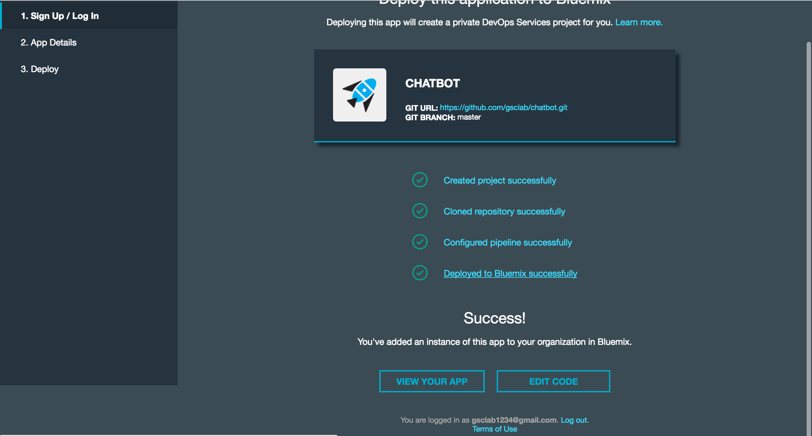
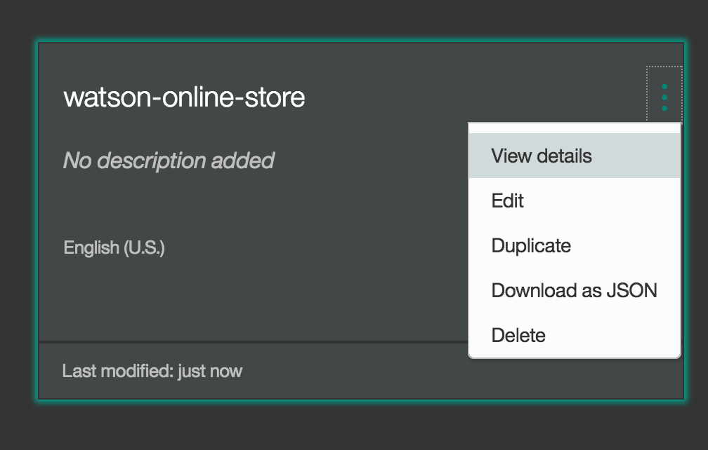
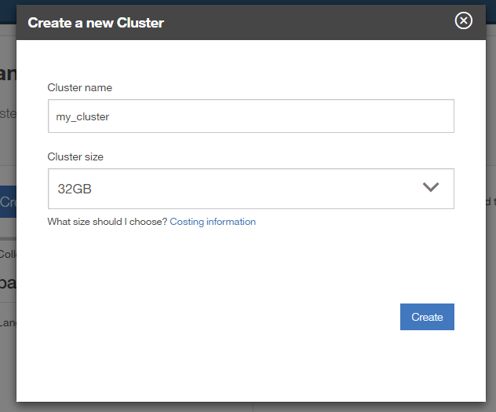

<!--

-->

# Multi - Domain Enterprise Digital Assistant

In this developer journey we will create a Watson Conversation, NLU & RnR based chatbot for multiple domains.
that provides users with:

* Answers important FAQs queries from the multiple domains such as across business lines of Loans, Account Opening, Market Place & Digital Banking of Banking industry.
* Also the chatbot solves transactional queries such as view transactions, balances, pay utility bills etc.

When the reader has completed this journey, they will understand how to:

* Create a chatbot with dialogs using Watson Conversation on NodeJS platform
* Learn how to best create Retrieve n Rank collection for long tail questions.
* Get enhanced natural language capability through NLU API
* Understand the Banking domain for creating a chatbot & using Conversation and Retrieve n Rank in sync.

## Technical Architecture - Enterprise Digital Assistant

## Flow

* The user writes a query about a service to the chatbot
* The orchestrator accepts query, saves the user context & starts a REST call with the Cognitive APIs.
* Depending on the nature of the query (long /Short tail), the answer is provided by either Watson Conversation API or Watson Retrieve and Rank
* Further to answering user queries, the agent can also be connected to Third party APIs such as India Stack(Aadhaar) for authentication required for verifying identify, e-sign, purchases etc. ;language translation APIs for localization.
* Orchestrator can be further exposed to enterprise systems such as CRM, warehouses, ERP etc. for contextual content.

## Features
* State & Context Management
* Large Information retrieval
* Personal Information Protection
* Recommendation Engine
* Enhanced Natural Language Understanding
* Enterprise Integration

## Included Components
* Bluemix Watson Conversation
* Bluemix Watson Retrieve n Rank
* Bluemix Watson Tone Analyzer
* Bluemix Watson Natural Language Understanding
* Node JS Runtime

## Deploy the App
[Lab Document Download](http://ibm.biz/Bdru7G)

a. Click on the 'Deploy to Bluemix' button below.

<i>Note: If you do not want to know the deploy steps below. Jump to after step 'f'.</i>

b. Log in with your Bluemix account.

&nbsp;&nbsp;&nbsp;&nbsp;&nbsp;&nbsp;&nbsp;&nbsp;&nbsp;&nbsp;&nbsp;&nbsp; 

c. If you are asked to choose an alias, then follow these instructions. Otherwise, proceed to [step 4](#4_view) in this section.

c.1 Enter a unique alias name and click create.
&nbsp;&nbsp;&nbsp;&nbsp;&nbsp;&nbsp;&nbsp;&nbsp;&nbsp;&nbsp;&nbsp;&nbsp; 

c.2 Verify your alias name and click continue.
&nbsp;&nbsp;&nbsp;&nbsp;&nbsp;&nbsp;&nbsp;&nbsp;&nbsp;&nbsp;&nbsp;&nbsp; 

d. Name your app, and then select the Region, Organization and Space where the app will be deployed. Click 'DEPLOY'.

&nbsp;&nbsp;&nbsp;&nbsp;&nbsp;&nbsp;&nbsp;&nbsp;&nbsp;&nbsp;&nbsp;&nbsp; 

* The status of the deployment is shown. This can take approximately 2 minutes to complete.

&nbsp;&nbsp;&nbsp;&nbsp;&nbsp;&nbsp;&nbsp;&nbsp;&nbsp;&nbsp;&nbsp;&nbsp;

* The deployment process performs the following actions:
- Creates the application.
- Creates a Conversation and Tone Analyzer service instance.

e.  After the deployment has completed, click on the 'Deployed to Bluemix sucessfully' link.

&nbsp;&nbsp;&nbsp;&nbsp;&nbsp;&nbsp;&nbsp;&nbsp;&nbsp;&nbsp;&nbsp;&nbsp;

You will land on the Overview page of your application.
If you like to try out the App, go ahead and click on 'View Your App'.

&nbsp;&nbsp;&nbsp;&nbsp;&nbsp;&nbsp;&nbsp;&nbsp;&nbsp;&nbsp;&nbsp;&nbsp;

f. The application and services have been successfully deployed, and you are now ready to begin the lab!

1. [Clone the repo](#1-clone-the-repo)
2. [Create Watson services on IBM Bluemix](#2-create-watson-services-on-ibm-bluemix)
3. [Configure Watson Conversation](#3-configure-watson-conversation)
4. [Configure Watson Retrieve and Rank](#4-configure-watson-retrieve-and-rank)
5. [Run the application](#5-run-the-application)

## 1. Clone the repo

Clone the `ConversationalBanking` locally. In a terminal, run:

  `$ git clone https://github.ibm.com/IBMDigital/ConversationalBanking`

We’ll be using the file [`dev-resources/WCS/workspace-onebanking.json`](dev-resources/WCS/wworkspace-onebanking.json) and the folder
[`dev-resources/WCS/`](dev-resources/WCS/)

## 2. Create Watson services on IBM Bluemix

Create the following services:

  * [**Watson Conversation**](https://console.ng.bluemix.net/catalog/services/conversation)
  * [**Watson Retrieve n Rank**](https://console.ng.bluemix.net/catalog/services/retrieve-and-rank)
  * [**Watson Tone Analyzer**](https://console.ng.bluemix.net/catalog/services/tone-analyzer)
  * [**Watson Natural language understanding**](https://console.ng.bluemix.net/catalog/services/natural-language-understanding)

  <i>Note: Ensure that you have logged into bluemix & allowed to use these services.</i>

## 3. Configure Watson Conversation

Launch the **Watson Conversation** tool. Use the **import** icon button on the right

  

Find the local version of [`dev-resources/WCS/workspace-onebanking.json`](dev-resources/WCS/workspace-onebanking.json) and select
**Import**. Find the **Workspace ID** by clicking on the context menu of the new
workspace and select **View details**. Save this ID for later.

  

*Optionally*, to view the conversation dialog select the workspace and choose the
**Dialog** tab, here's a snippet of the dialog:

## 4. Configure Watson Retrieve and Rank

Launch the **Watson retrieve-and-rank** tool. Create a **new data cluster**.

  

Seed the content by firstly creating **New Collection**, and add the file documents and questions present under [`dev-resources/Retrieve&Rank/`](dev-resources/Retrieve&Rank/)

  

  Note: Ensure that you have also created a [**Watson Document Conversion**](https://console.ng.bluemix.net/catalog/services/document-conversion) service as well. Since, Watson RnR uses document conversion at the backend.</i>
## 5. Run the application

### If you used the Deploy to Bluemix button...

If you used ``Deploy to Bluemix``, most of the setup is automatic to start using the App.

### If you want to run it locally...

Otherwise as explained above:
1. Clone the repo
2. Instantiate/ Configure the above watson services
2. Install NodeJS runtime or npm.
3. Start the app and it can be used at localhost:3000

Note: server host can be changed as required in server.js

# License

This sample code is licensed under Apache 2.0.
Full license text is available in [LICENSE](LICENSE).

# Contributing

You are most welcome to contribute to this project.
Please find the details about it in [CONTRIBUTING](CONTRIBUTING.md)

#Maintaining

Your are most welcome to help us in maintaining this project.
Please find the details about it in [MAINTAINING](MAINTAINERS.md)

## Open Source @ IBM

Find more open source projects on the
[IBM Github Page](http://ibm.github.io/).
