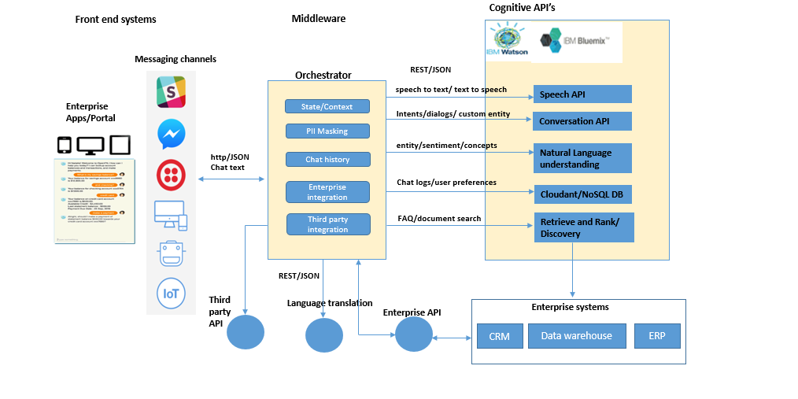
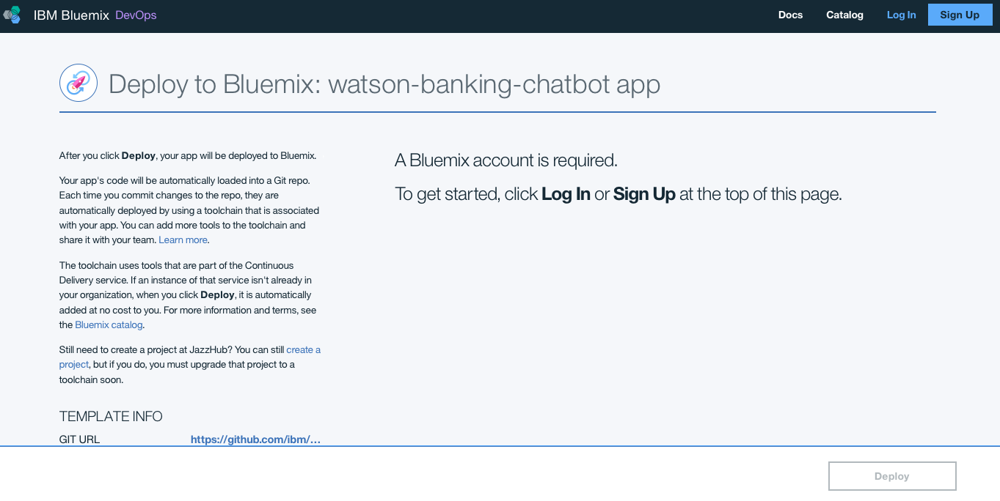
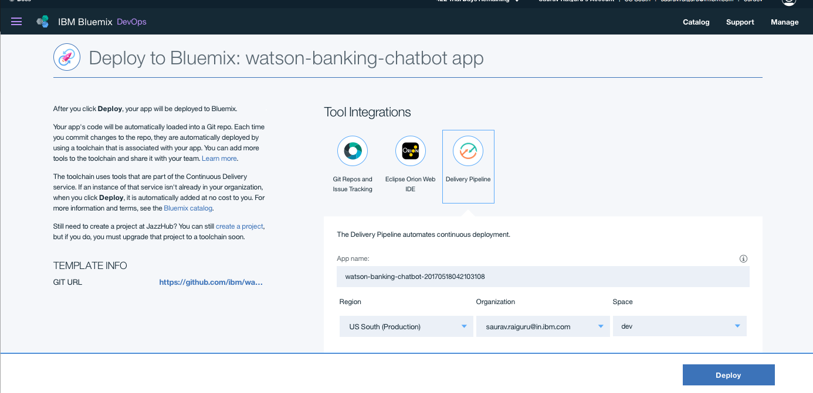
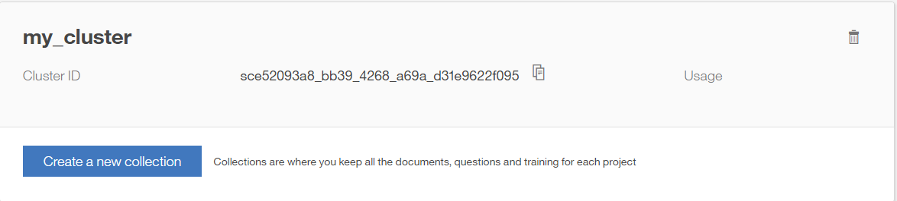
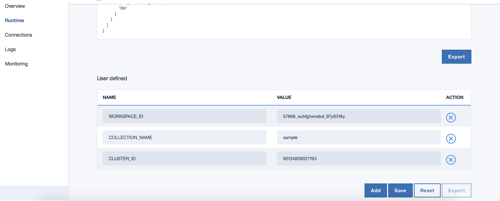
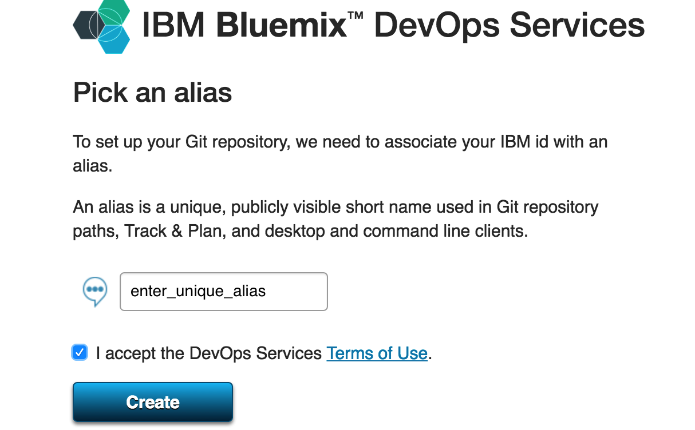
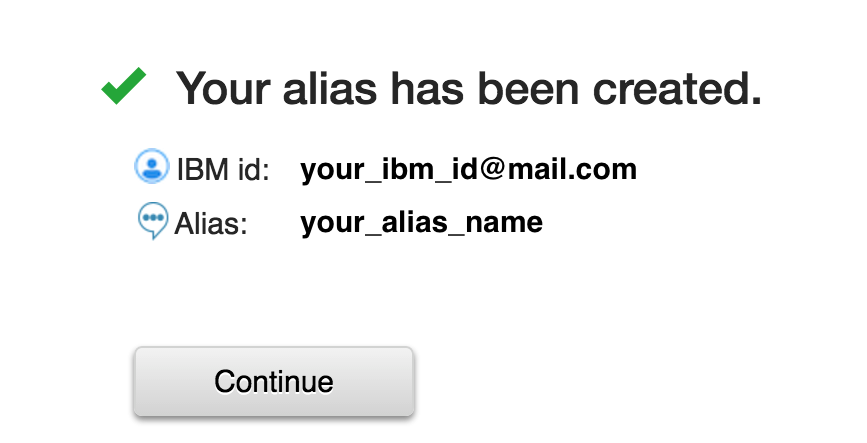
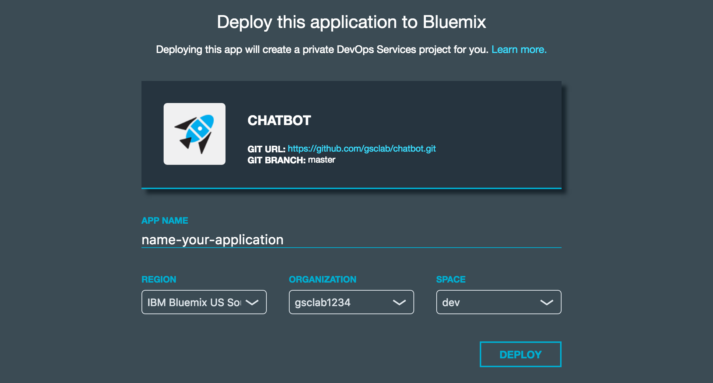

<!-- TODO:

-->

# Multi - Domain Enterprise Digital Assistant

In this developer journey we will create a Watson Conversation, NLU & RnR based chatbot for multiple domains.
that provides users with:

* Answers important FAQs queries from the multiple domains such as across business lines of Loans, Account Opening, Market Place & Digital Banking of Banking industry.
* Also the chatbot solves transactional queries such as view transactions, balances, pay utility bills etc.

When the reader has completed this journey, they will understand how to:

* Create a chatbot with dialogs using Watson Conversation on NodeJS platform
* Learn how to best create Retrieve n Rank collection for long tail questions.
* Get enhanced natural language capability through NLU API
* Understand the Banking domain for creating a chatbot & using Conversation and Retrieve n Rank in sync.

## Technical Architecture - Enterprise Digital Assistant

## Flow

* The user writes a query about a service to the chatbot
* The orchestrator accepts query, saves the user context & starts a REST call with the Cognitive APIs.
* Depending on the nature of the query (long /Short tail), the answer is provided by either Watson Conversation API or Watson Retrieve and Rank
* Further to answering user queries, the agent can also be connected to Third party APIs such as India Stack(Aadhaar) for authentication required for verifying identify, e-sign, purchases etc. ;language translation APIs for localization.
* Orchestrator can be further exposed to enterprise systems such as CRM, warehouses, ERP etc. for contextual content.

## Features
* State & Context Management
* Large Information retrieval
* Personal Information Protection
* Recommendation Engine
* Enhanced Natural Language Understanding
* Enterprise Integration

## Included Components
* Bluemix Watson Conversation
* Bluemix Watson Retrieve n Rank
* Bluemix Watson Tone Analyzer
* Bluemix Watson Natural Language Understanding
* Node JS Runtime

## Deploy the App

NOTE: Perform steps 1-6 OR click the Deploy to Bluemix button to do it all at once!

1. Log in to your Bluemix account before deploying.
If already logged in, then ignore this step.

2. We can see that the app is ready to be deplyed, and we need to ensure that the App name, region, Organization, Space is valid before 'Deploy'.

3. In Toolchain, the app is deployed. There are also option to edit code via eclipseIDE, git changes if required.
Once deployed, the app can be viewed by clicking 'View app'.

4. Wait for the deployment to complete, the following actions will be performed:

  * Creates the application.
  * Creates a Conversation and Retrieve & Rank service instance.

5.
It is required to configure the Conversation and R-n-R service that is created. We can follow the next steps

6. Configure Watson Conversation

Launch the **Watson Conversation** tool. Use the **import** icon button on the right

  

Find the local version of [`data/WCS/workspace-ConversationalBanking.json`](data/WCS/workspace-ConversationalBanking.json) and select
**Import**. Find the **Workspace ID** by clicking on the context menu of the new
workspace and select **View details**.
###### Save this ID for later.

  

*Optionally*, to view the conversation dialog select the workspace and choose the
**Dialog** tab, here's a snippet of the dialog:

7. Configure Watson Retrieve and Rank

Launch the **Watson retrieve-and-rank** tool. Create a **new data cluster**.

###### Save this CLUSTER_ID for later.

Seed the content by firstly creating **New Collection**, and add the file documents and questions present under [`data/Retrieve&Rank/`](data/Retrieve&Rank/)

###### Save this COLLECTION_NAME for later.

> Note: Ensure that you have also created a [**Watson Document Conversion**](https://console.ng.bluemix.net/catalog/services/document-conversion) service as well. Since, Watson RnR uses document conversion at the backend.

8. Once the watson services are configured, Go to View App -> Runtime -> Environment Variables -> User Defined, add the IDs saved above and save it.

The application and services have been successfully deployed, and you are now ready to use the application.

# Steps

1. [Clone the repo](#1-clone-the-repo)
2. [Create Watson services on IBM Bluemix](#2-create-watson-services-on-ibm-bluemix)
3. [Configure Watson Conversation](#3-configure-watson-conversation)
4. [Configure Watson Retrieve and Rank](#4-configure-watson-retrieve-and-rank)
5. [Run the application](#5-run-the-application)

## 1. Clone the repo

Clone the `ConversationalBanking` locally. In a terminal, run:

`$ git clone https://github.ibm.com/IBMDigital/ConversationalBanking`

We’ll be using the file [`data/WCS/workspace-ConversationalBanking.json`](data/WCS/workspace-ConversationalBanking.json) and the folder
[`data/WCS/`](data/WCS/)

## 2. Create Watson services on IBM Bluemix

Create the following services:

* [**Watson Conversation**](https://console.ng.bluemix.net/catalog/services/conversation)
* [**Watson Retrieve n Rank**](https://console.ng.bluemix.net/catalog/services/retrieve-and-rank)
* [**Watson Tone Analyzer**](https://console.ng.bluemix.net/catalog/services/tone-analyzer)
* [**Watson Natural language understanding**](https://console.ng.bluemix.net/catalog/services/natural-language-understanding)

> Note: Ensure that you have logged into Bluemix and are allowed to use these services.

## 3. Configure Watson Conversation

Launch the **Watson Conversation** tool. Use the **import** icon button on the right

  

Find the local version of [`data/WCS/workspace-ConversationalBanking.json`](data/WCS/workspace-ConversationalBanking.json) and select
**Import**. Find the **Workspace ID** by clicking on the context menu of the new
workspace and select **View details**. Save this ID for later.

  

*Optionally*, to view the conversation dialog select the workspace and choose the
**Dialog** tab, here's a snippet of the dialog:

## 4. Configure Watson Retrieve and Rank

Launch the **Watson retrieve-and-rank** tool. Create a **new data cluster**.

Seed the content by firstly creating **New Collection**, and add the file documents and questions present under [`data/Retrieve&Rank/`](data/Retrieve&Rank/)

> Note: Ensure that you have also created a [**Watson Document Conversion**](https://console.ng.bluemix.net/catalog/services/document-conversion) service as well. Since, Watson RnR uses document conversion at the backend.

## 5. Run the application

### If you used the Deploy to Bluemix button...

If you used ``Deploy to Bluemix``, most of the setup is automatic to start using the App.

### If you want to run it locally...

Otherwise as explained above:
1. Clone the repo
2. Instantiate/ Configure the above watson services
2. Install NodeJS runtime or npm.
3. Start the app and it can be used at localhost:3000

> Note: server host can be changed as required in server.js

# Troubleshooting tips

If you are using the IBM Jazz DevOps to deploy the app, you may see the following steps as required to deploy:

1. *Optional:* If you are asked to choose an alias, enter a unique alias name and click create.

2. *Optional:* If you are asked to choose an alias, verify your alias name and click continue.

3. Name your app, and then select the Region, Organization and Space where the app will be deployed. Click 'DEPLOY'.

# License

This sample code is licensed under Apache 2.0.
Full license text is available in [LICENSE](LICENSE).

# Links

* [Lab Document](http://ibm.biz/Bdru7G): Detailed guide on how to deploy this app
* [CONTRIBUTING](CONTRIBUTING.md): Guide to contribute to this project
* [MAINTAINING](MAINTAINERS.md): Rules for maintainer of this project
* [Open Source @ IBM](http://ibm.github.io/): Find more open source projects on the
