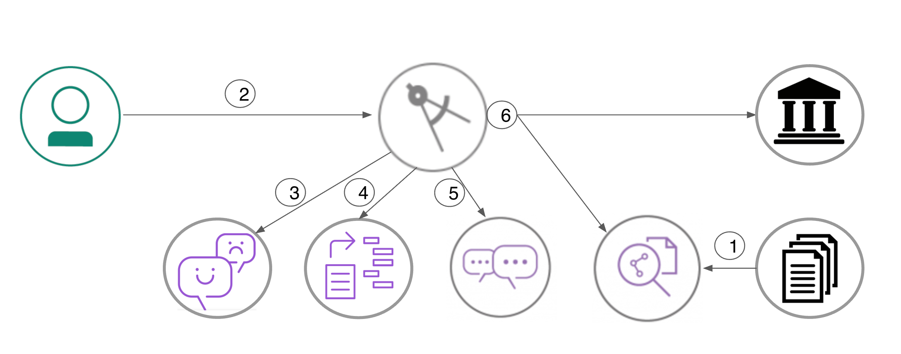
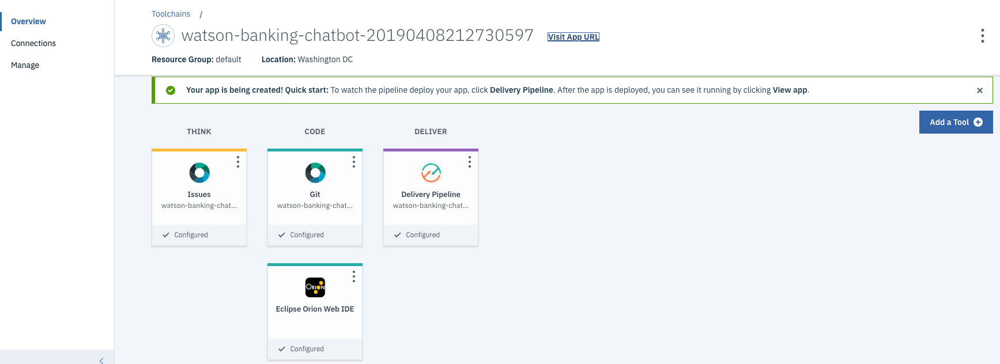
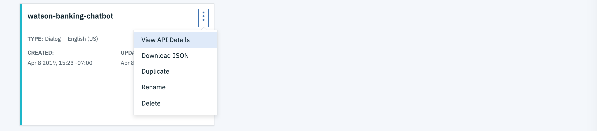
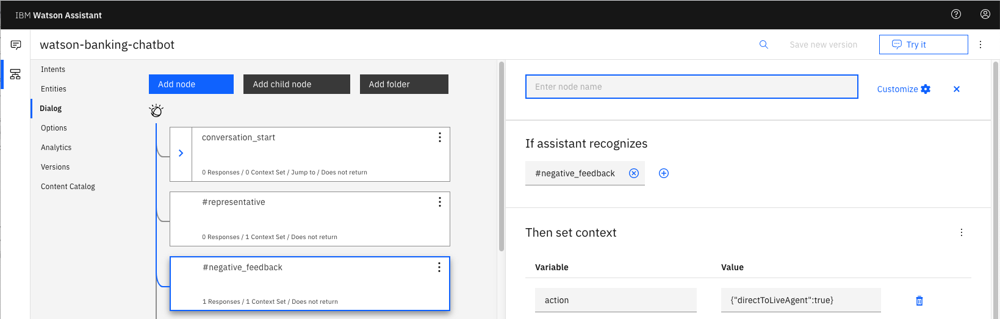
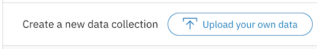
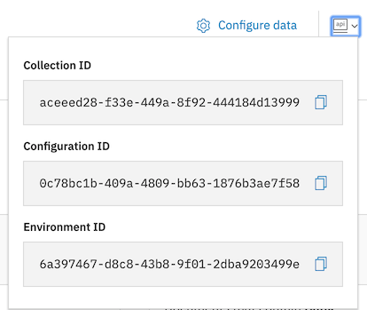
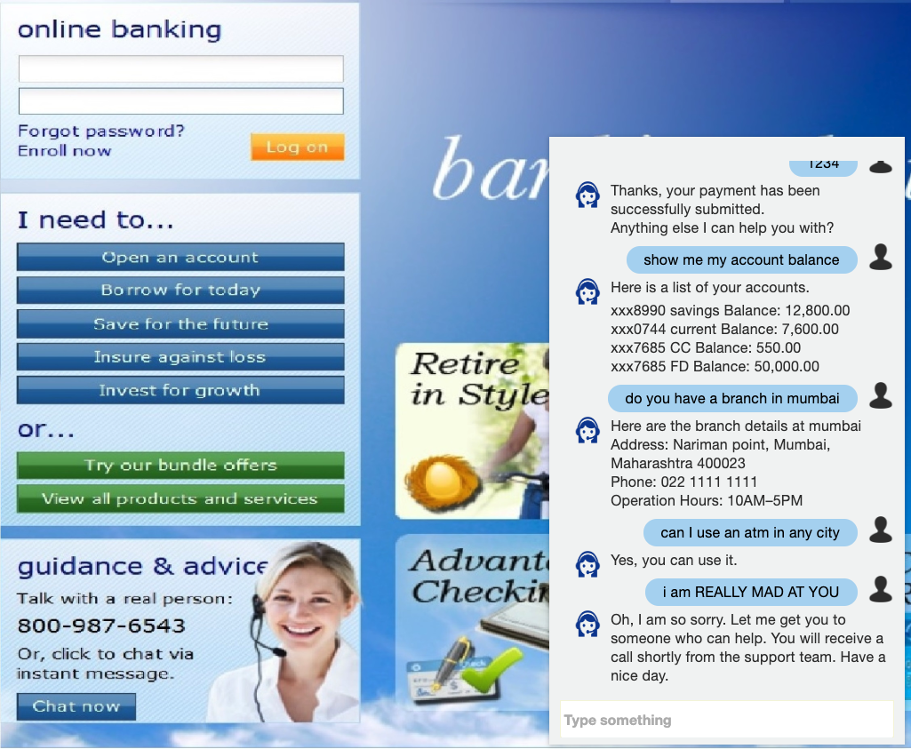

[](https://travis-ci.org/IBM/watson-banking-chatbot)


> Watson Conversation is now Watson Assistant. Although some images in this code pattern may show the service as Watson Conversation, the steps and processes will still work.

# Create a banking chatbot with FAQ discovery, anger detection and natural language understanding

In this code pattern, we will create a chatbot using Node.js and Watson Assistant. The Assistant flow will be enhanced by using Natural Language Understanding to identify entities and using Tone Analyzer to detect customer emotions. For FAQs, a call to the Discovery service will use passage retrieval to pull answers from a collection of documents.

When the reader has completed this pattern, they will understand how to:

* Create a chatbot that converses via a web UI using Watson Assistant and Node.js
* Use Watson Discovery with passage retrieval to find answers in FAQ documents
* Use Watson Tone Analyzer to detect emotion in a conversation
* Identify entities with Watson Natural Language Understanding



## Flow

1. The FAQ documents are added to the Discovery collection.
2. The user interacts with a chatbot via the app UI.
3. User input is processed with Tone Analyzer to detect anger. An anger score is added to the context.
4. User input is processed with Natural Language Understanding (NLU). The context is enriched with NLU-detected entities and keywords (e.g., a location).
5. The input and enriched context is sent to Assistant. Assistant recognizes intent, entities and dialog paths. It responds with a reply and/or action.
6. Optionally, a requested action is performed by the app. This may include one of the following:
   * Lookup additional information from bank services to append to the reply
   * Use Discovery to reply with an answer from the FAQ documents

## Included components

* [IBM Watson Assistant](https://www.ibm.com/cloud/watson-assistant/): Build, test and deploy a bot or virtual agent across mobile devices, messaging platforms, or even on a physical robot.
* [IBM Watson Discovery](https://www.ibm.com/watson/services/discovery/): A cognitive search and content analytics engine for applications to identify patterns, trends, and actionable insights.
* [IBM Watson Natural Language Understanding](https://www.ibm.com/watson/services/natural-language-understanding/): Analyze text to extract meta-data from content such as concepts, entities, keywords, categories, sentiment, emotion, relations, semantic roles, using natural language understanding.
* [IBM Watson Tone Analyzer](https://www.ibm.com/watson/services/tone-analyzer/): Uses linguistic analysis to detect communication tones in written text.

## Featured technologies

* [Node.js](https://nodejs.org/): An asynchronous event driven JavaScript runtime, designed to build scalable applications.

# Watch the Video

[](https://www.youtube.com/watch?v=Jxi7U7VOMYg)

# Steps

Use the ``Deploy to IBM Cloud`` button **OR** create the services and run locally.

## Deploy to IBM Cloud

[](https://cloud.ibm.com/devops/setup/deploy?repository=https://github.com/IBM/watson-banking-chatbot.git)

1. Press the above `Deploy to IBM Cloud` button and then click on `Deploy`.

2. In Toolchains, click on `Delivery Pipeline` to watch while the app is deployed. Once deployed, the app can be viewed by clicking `View app`.

   

3. To see the app and services created and configured for this journey, use the IBM Cloud dashboard. The app is named `watson-banking-chatbot` with a unique suffix. The following services are created and easily identified by the `wbc-` prefix:
    * wbc-conversation-service
    * wbc-discovery-service
    * wbc-natural-language-understanding-service
    * wbc-tone-analyzer-service

If you encounter deployment errors, refer to [Troubleshooting](#troubleshooting).

## Run locally

> NOTE: These steps are only needed when running locally instead of using the ``Deploy to IBM Cloud`` button.

1. [Clone the repo](#1-clone-the-repo)
2. [Create Watson services with IBM Cloud](#2-create-watson-services-with-ibm-cloud)
3. [Import the Watson Assistant skill](#3-import-the-watson-assistant-skill)
4. [Load the Discovery documents](#4-load-the-discovery-documents)
5. [Configure credentials](#5-configure-credentials)
6. [Run the application](#6-run-the-application)

### 1. Clone the repo

Clone the `watson-banking-chatbot` locally. In a terminal, run:

```bash
git clone https://github.com/IBM/watson-banking-chatbot
```

We’ll be using the file [`data/conversation/workspaces/banking.json`](data/conversation/workspaces/banking.json) and the folder
[`data/conversation/workspaces/`](data/conversation/workspaces/)

### 2. Create Watson services with IBM Cloud

Create the following services:

* [**Watson Assistant**](https://cloud.ibm.com/catalog/services/conversation)
* [**Watson Discovery**](https://cloud.ibm.com/catalog/services/discovery)
* [**Watson Tone Analyzer**](https://cloud.ibm.com/catalog/services/tone-analyzer)
* [**Watson Natural Language Understanding**](https://cloud.ibm.com/catalog/services/natural-language-understanding)

### 3. Import the Watson Assistant skill

* Find the Assistant service in your IBM Cloud Dashboard.
* Click on the service and then click on `Launch tool`.
* Go to the `Skills` tab.
* Click `Create new`
* Click the `Import skill` tab.
* Click `Choose JSON file`, go to your cloned repo dir, and `Open` the workspace.json file in `data/conversation/workspaces/banking.json`.
* Select `Everything` and click `Import`.

To find the `WORKSPACE_ID` for Watson Assistant:

* Go back to the `Skills` tab.
* Click on the three dots in the upper right-hand corner of the **watson-banking-chatbot** card and select `View API Details`.
* Copy the `Workspace ID` GUID.
  

*Optionally*, to view the Assistant dialog, click on the skill and choose the
`Dialog` tab. Here's a snippet of the dialog:



### 4. Load the Discovery documents

* Find the Discovery service in your IBM Cloud Dashboard.
* Click on the service and then click on `Launch tool`.
* Create a new data collection by hitting the `Upload your own data` button.  
  
  * Provide a collection name
  * Keep the `Default Configuration` and `English` language
  * Click `Create`
* Use `Drag and drop your documents here or browse from computer` to seed the content with the five documents in `data/discovery/docs` of your cloned repo.
* Click on `Use this collection in API` and save the `Environment Id` and `Collection Id` for your `.env` file in the next step.  
  

### 5. Configure credentials

Collect the credentials for the IBM Cloud services (Assistant, Discovery, Tone Analyzer and Natural Language Understanding). For each of these services:

* Find the service in your IBM Cloud Dashboard.
* Click on the service.
* Hit `Manage` in the left sidebar menu.
* Copy the `API Key` and `URL`.

The other settings for Assistant and Discovery were collected during the
earlier setup steps (`DISCOVERY_COLLECTION_ID`, `DISCOVERY_ENVIRONMENT_ID` and
`WORKSPACE_ID`).

Copy the [`env.sample`](env.sample) to `.env`.

```bash
cp env.sample .env
```

Edit the `.env` file with the necessary credentials and settings.

#### `env.sample:`

```bash
# Copy this file to .env and replace the credentials with
# your own before starting the app.

# Note: If you are using older services, you may need _USERNAME and _PASSWORD
# instead of _IAM_APIKEY.

# Watson Assistant
WORKSPACE_ID=<add_assistant_workspace>
ASSISTANT_URL=<add_assistant_url>
ASSISTANT_IAM_APIKEY=<add_assistant_iam_apikey>

# Watson Discovery
DISCOVERY_URL=<add_discovery_url>
DISCOVERY_ENVIRONMENT_ID=<add_discovery_environment_id>
DISCOVERY_COLLECTION_ID=<add_discovery_collection_id>
DISCOVERY_IAM_APIKEY=<add_discovery_iam_apikey>

# Watson Natural Language Understanding
NATURAL_LANGUAGE_UNDERSTANDING_URL=<add_nlu_url>
NATURAL_LANGUAGE_UNDERSTANDING_IAM_APIKEY=<add_nlu_iam_apikey>

# Watson Tone Analyzer
TONE_ANALYZER_URL=<add_tone_analyzer_url>
TONE_ANALYZER_IAM_APIKEY=<add_tone_analyzer_iam_apikey>

# Run locally on a non-default port (default is 3000)
# PORT=3000
```

### 6. Run the application

1. Install [Node.js](https://nodejs.org/en/) runtime or NPM.
1. Start the app by running `npm install`, followed by `npm start`.
1. Use the chatbot at `localhost:3000`.

> Note: server host can be changed as required in server.js and `PORT` can be set in `.env`.

# Sample output



# Links

* [Demo on Youtube](https://www.youtube.com/watch?v=Jxi7U7VOMYg)
* [Watson Node.js SDK](https://github.com/watson-developer-cloud/node-sdk)
* [Relevancy Training Demo Video](https://www.youtube.com/watch?v=8BiuQKPQZJk)
* [Relevancy Training Demo Notebook](https://github.com/akmnua/relevancy_passage_bww)

# Troubleshooting

* Error: Server error, status code: 409, error code: 60016, message: An operation for service instance wbc-discovery-service is in progress.

  > This indicates that the Discovery service is still being provisioned. Wait a few minutes and click the `Run` button to restart the application.

* Error: Environment {GUID} is still not active, retry once status is active

  > This is common during the first run. The app tries to start before the Discovery environment is fully created. Wait a few minutes and click the `Run` button to restart the application.

* Error: Only one free environment is allowed per organization

  > To work with a free trial, a small free Discovery environment is created. If you already have
a Discovery environment, this will fail. If you are not using Discovery, check for an old
service thay you may want to delete. Otherwise use the .env DISCOVERY_ENVIRONMENT_ID to tell
the app which environment you want it to use. A collection will be created in this environment
using the default configuration.

# License

This code pattern is licensed under the Apache License, Version 2. Separate third-party code objects invoked within this code pattern are licensed by their respective providers pursuant to their own separate licenses. Contributions are subject to the [Developer Certificate of Origin, Version 1.1](https://developercertificate.org/) and the [Apache License, Version 2](https://www.apache.org/licenses/LICENSE-2.0.txt).

[Apache License FAQ](https://www.apache.org/foundation/license-faq.html#WhatDoesItMEAN)
