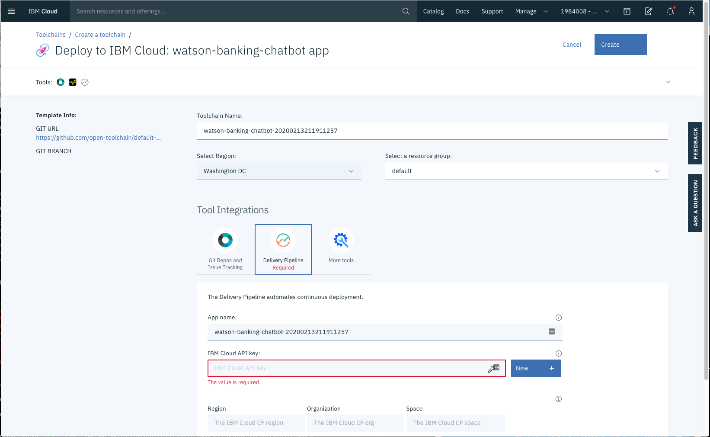

# Run on IBM Cloud with Cloud Foundry

This document shows how to run the application using Cloud Foundry on IBM Cloud.

## Steps

1. Press the above `Deploy to IBM Cloud` button and then...

   

   * Create an API key by pressing the `Create+` button located next to the `IBM Cloud API key` field and then `Create` in the pop-up.
   * Select your region, organization, and space (or use the defaults).
   * Click `Create` at the top of the panel to start the deployment process.

2. From the Toolchains view, click on the `Delivery Pipeline` to watch while the app is deployed. Here you'll be able to see logs about the deployment.

   

3. Go to your IBM Cloud resource list and find the Assistant service. There will be a Cloud Foundry service named `wbc-assistant-service` which is linked to the actual service. Click on the Assistant service and you will see a `Manage` tab showing an `API key` and a `URL`. Go back to your resource list and click on the Cloud Foundry application named `watson-banking-chatbot` (with a timestamp suffix). Click on `Runtime environment` and add `ASSISTANT_APIKEY` and `ASSISTANT_URL` with the above values. The app will restart with the new runtime environment.

> Note: You may need to re-run the deploy stage (see [Troubleshooting](https://github.com/IBM/watson-banking-chatbot#Troubleshooting)).

## Run the web app

To see the app and services created and configured for this code pattern, use the IBM Cloud dashboard. The Cloud Foundry app is named `watson-banking-chatbot` with a timestamp suffix. Click on the app and then click on `Visit App URL`.

The following services are created and easily identified by the `wbc-` prefix:

* `wbc-assistant-service`
* `wbc-discovery-service`
* `wbc-natural-language-understanding-service`

Go back to the README.md for instructions on how to use the web app.

> NOTE: The Watson Assistant dialog has been reduced to work with Lite plans. If you are looking for all of the previous functionality, you can manually import [`full_banking.json`](../../data/conversation/workspaces/full_banking.json). Follow the instructions in [5. Customize the Watson Assistant skill](../../README.md#5-customize-the-watson-assistant-skill) to import and configure it.

