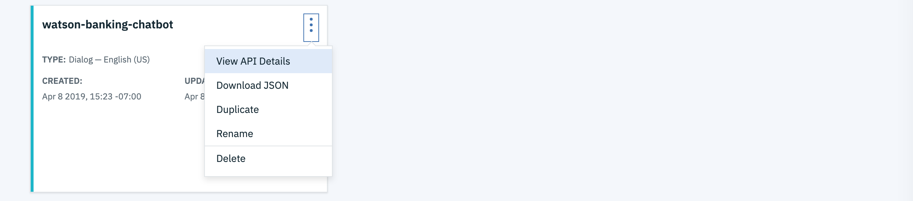
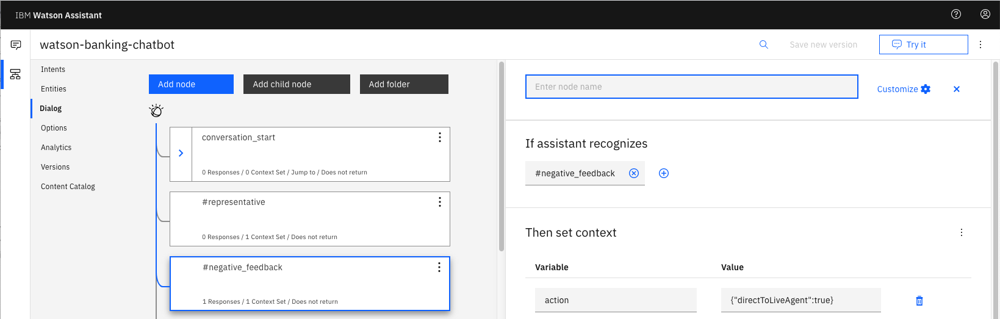

# Run Locally

This document shows how to run the application using on your local machine.

## Steps

1. [Clone the repo](#1-clone-the-repo)
2. [Create Watson services with IBM Cloud](#2-create-watson-services-with-ibm-cloud)
3. [Import the Watson Assistant skill](#3-import-the-watson-assistant-skill)
4. [Load the Discovery documents](#4-load-the-discovery-documents)
5. [Configure credentials](#5-configure-credentials)
6. [Run the application](#6-run-the-application)

### 1. Clone the repo

Clone the `watson-banking-chatbot` locally. In a terminal, run:

```bash
git clone https://github.com/IBM/watson-banking-chatbot
```

### 2. Create Watson services with IBM Cloud

Create the following services:

* [**Watson Assistant**](https://cloud.ibm.com/catalog/services/conversation)
* [**Watson Discovery**](https://cloud.ibm.com/catalog/services/discovery)
* [**Watson Tone Analyzer**](https://cloud.ibm.com/catalog/services/tone-analyzer)
* [**Watson Natural Language Understanding**](https://cloud.ibm.com/catalog/services/natural-language-understanding)

### 3. Import the Watson Assistant skill

* Find the Assistant service in your IBM Cloud Dashboard.
* Click on the service and then click on `Launch tool`.
* Go to the `Skills` tab.
* Click `Create skill`
* Click the `Import skill` tab.
* Click `Choose JSON file`, go to your cloned repo dir, and `Open` the JSON file in `data/conversation/workspaces/banking_US.json` (or the old full version in `full_banking.json`). `banking_IN.json` is used for content for banking in India and `banking_US.json` is used for content for banking in United States.
* Select `Everything` and click `Import`.

To find the `Skill_ID` for Watson Assistant:

* Go back to the `Skills` tab.
* Click on the three dots in the upper right-hand corner of the **watson-banking-chatbot** card and select `View API Details`.
* Copy the `Skill ID` GUID.

  

*Optionally*, to view the Assistant dialog, click on the skill and choose the
`Dialog` tab. Here's a snippet of the dialog:



### 4. Load the Discovery documents

* Find the Discovery service in your IBM Cloud Dashboard.
* Click on the service and then click on `Launch tool`.
* Create a new data collection by hitting the `Upload your own data` button.

  
  * Provide a collection name
  * Select `English` language
  * Click `Create`

* Use `Drag and drop your documents here or select documents` to seed the content with the five documents in `data/discovery/docs` of your cloned repo.
* Click on the upper-right `api` icon and save the `Environment Id` and `Collection Id` for your `.env` file in the next step.

  

### 5. Configure credentials

Collect the credentials for the IBM Cloud services (Assistant, Discovery, Tone Analyzer and Natural Language Understanding). For each of these services:

* Find the service in your IBM Cloud Dashboard.
* Click on the service.
* Hit `Manage` in the left sidebar menu.
* Copy the `API Key` and `URL`.

The other settings for Assistant and Discovery were collected during the
earlier setup steps (`DISCOVERY_COLLECTION_ID`, `DISCOVERY_ENVIRONMENT_ID` and
`WORKSPACE_ID`).

Copy the [`env.sample`](../../env.sample) to `.env`.

```bash
cp env.sample .env
```

Edit the `.env` file with the necessary credentials and settings.

#### `env.sample:`

```bash
# Copy this file to .env and replace the credentials with
# your own before starting the app.

# Watson Assistant
ASSISTANT_APIKEY=zzZzzABCsU8DBrvi123HLZwVyHbRlBFf_97n9O123ABC
ASSISTANT_URL=https://gateway.watsonplatform.net/assistant/api

# Watson Discovery
DISCOVERY_APIKEY=a1b2c3JZmZZZZSq3NYabckevKa123AwqD9HlWIUvabCd
DISCOVERY_URL=https://gateway.watsonplatform.net/discovery/api

# Watson Natural Language Understanding
NATURAL_LANGUAGE_UNDERSTANDING_APIKEY=A1zzzzzz5E8yFG1t9H9kFeCBR_Lq123pWj7abcdFCE11
NATURAL_LANGUAGE_UNDERSTANDING_URL=https://gateway.watsonplatform.net/natural-language-understanding/api

# Watson Tone Analyzer
TONE_ANALYZER_APIKEY=abcDEF-_zZZ4CTXnVabcde4tZZQOdhxPzoEcaGH1234W
TONE_ANALYZER_URL=https://gateway.watsonplatform.net/tone-analyzer/api

# Run locally on a non-default port (default is 3000)
# PORT=3000

# Set LOCALE=en_IN for the original India bank version.
# LOCALE=en_IN
```

> Note: if you are trying to run this project as workshop in India then use `Locale=en_IN`

### 6. Run the application

1. Install [Node.js](https://nodejs.org/en/) runtime or NPM.
1. Start the app by running `npm install`, followed by `npm start`.
1. Use the chatbot at `localhost:3000`.

> Note: server host can be changed as required in server.js and `PORT` can be set in `.env`.

[](https://github.com/IBM/watson-banking-chatbot#deployment-options)
