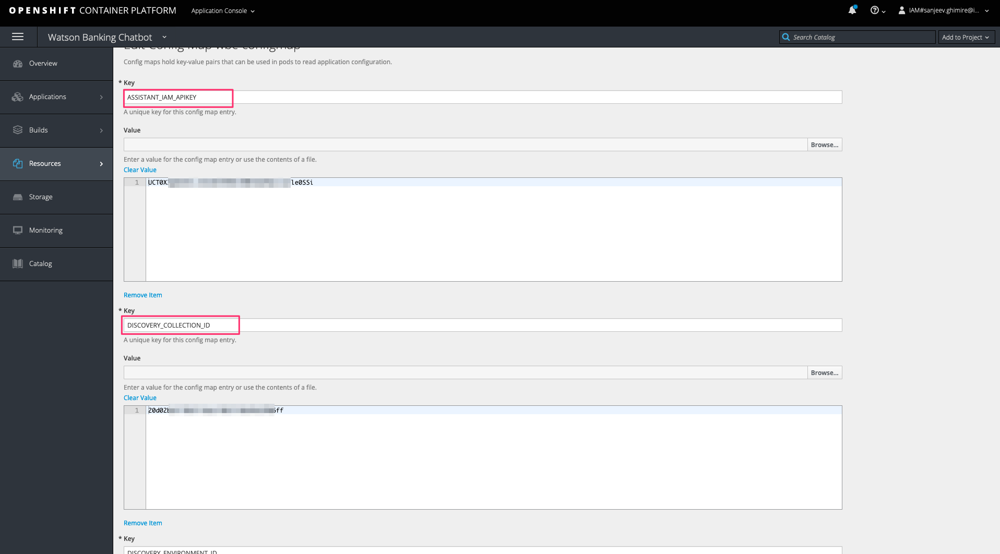
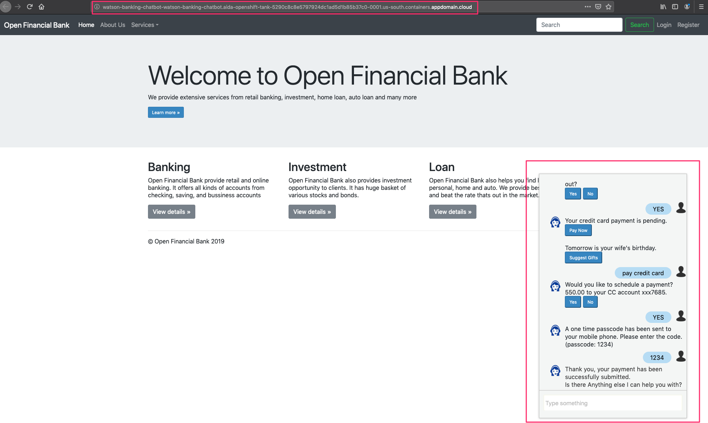

# Run on Red Hat OpenShift

This document shows how to run the `Watson Banking Chatbot` application in a container running on Red Hat OpenShift.

## Prerequisites

You will need a running OpenShift cluster, or OKD cluster. You can provision [OpenShift on the IBM Cloud](https://cloud.ibm.com/kubernetes/catalog/openshiftcluster).

## Steps

* In your cluster, open your project or click on `+ Create Project` to create one.

* In the `Overview` tab, click on `Browse Catalog`

  

* Choose the `Node.js` app container and click `Next`.

  

* Give your app a name and add `https://github.com/IBM/watson-banking-chatbot` for the github repo, then click `Create`.

  

* You will need to export the key/value pairs from [env.sample](../../env.sample) as a config map. The key would be the key in env.sample and values would be the credentials of each key that you got from IBM cloud.

  

* Also add key `PORT` with the value `8080`.

* Go to the `Applications` tab, choose `Deployments` and the `Environment` tab. Under `Environment From` `Config Map/Secret` choose the config map you just created [1]. Save the config [2]. The app will re-deploy automatically, or click `Deploy` to re-deploy manually [3]. To see the variables in the Config Map that will be exported in the app environment, click `View Details`.

  

* Under `Applications` -> `Routes` you will see your app. Click on the `Hostname` to see your Watson banking chatbot in action.

  

