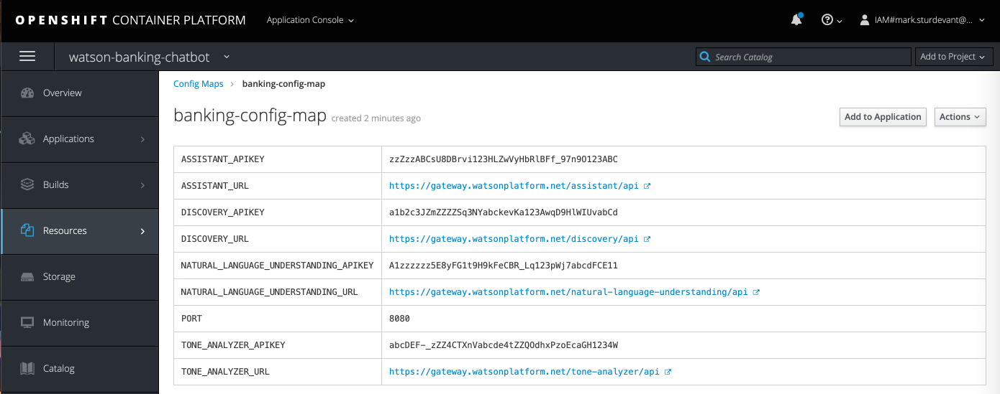

# Run on Red Hat OpenShift

This document shows how to run the `Watson Banking Chatbot` application in a container running on Red Hat OpenShift.

## Prerequisites

You will need a running OpenShift cluster, or OKD cluster. You can provision [OpenShift on the IBM Cloud](https://cloud.ibm.com/kubernetes/catalog/openshiftcluster).

## Steps

1. [Create an OpenShift project](#1-create-an-openshift-project)
1. [Create the config map](#2-create-the-config-map)
1. [Get a secure endpoint](#3-get-a-secure-endpoint)
1. [Run the web app](#4-run-the-web-app)

## 1. Create an OpenShift project

* Using the OpenShift web console, select the `Application Console` view.

  

* Use the `+Create Project` button to create a new project, then click on your project to open it.

* In the `Overview` tab, click on `Browse Catalog`.

  

* Choose the `Node.js` app container and click `Next`.

  

* Give your app a name and add `https://github.com/IBM/watson-banking-chatbot` for the github repo, then click `Create`.

  

## 2. Create the config map

* Click on the `Resources` tab and choose `Config Maps` and then click the `Create Config Map` button.
  * Provide a `Name` for the config map.
  * Add a key named `PORT` and paste in the `8080` under `Enter a value...`.
  * For each of the following key/value pairs, click `Add Item` to add the key, and then paste the value in the `Enter a value...` field. The necessary keys to configure will depend on whether you are provisioning services using IBM Cloud Pak for Data or on IBM Cloud.

Click to expand one:

<b>IBM Cloud Pak for Data</b>

Collect the credentials for IBM Cloud Pak for Data provisioned services (Assistant, Discovery and Natural Language Understanding). For each of these services:

<h5>Gather service credentials</h5>

<ol>
    <li>For production use, create a user to use for authentication. From the main navigation menu (☰), select <b>Administer > Manage users</b> and then <b>+ New user</b>.</li>
    <li>From the main navigation menu (☰), select <b>My instances</b>.</li>
    <li>On the <b>Provisioned instances</b> tab, find your service instance, and then hover over the last column to find and click the ellipses icon. Choose <b>View details</b>.</li>
    <li>Copy the <b>URL</b> to use as the <b>{SERVICE_NAME}_URL</b> when you configure credentials.</li>
    <li><i>Optionally, copy the <b>Bearer token</b> to use in development testing only. It is not recommended to use the bearer token except during testing and development because that token does not expire.</i></li>
    <li>Use the <b>Menu</b> and select <b>Users</b> and <b>+ Add user</b> to grant your user access to this service instance. This is the user name (and password) you will use when you configure credentials to allow the Node.js server to authenticate.</li>
</ol>

The other settings for Assistant and Discovery were collected during the
earlier setup steps detailed in the main [README](https://github.com/IBM/watson-banking-chatbot/blob/master/README.md) page. See the setup sections for each service to determine where to find `DISCOVERY_COLLECTION_ID` and Assistant `SKILL_ID`.

For each service (<b>ASSISTANT, DISCOVERY, and NATURAL_LANGUAGE_UNDERSTANDING</b>) the following settings are needed with the service name as a prefix:

* Set <b>_AUTH_TYPE</b> to <b>cp4d</b>
* Provide the <b>_URL</b>, <b>_USERNAME</b> and <b>_PASSWORD</b> for the user added to this service instance.
* For the <b>_AUTH_URL</b> use the base fragment of your URL including the host and port. <i>I.e. https://{cpd_cluster_host}{:port}</i>.
* If your CPD installation is using a self-signed certificate, you need to disable SSL verification with both <b>_AUTH_DISABLE_SSL</b> and <b>_DISABLE_SSL</b>. Disable SSL only if absolutely necessary, and take steps to enable SSL as soon as possible.

  | Key | Value |
  | --- | --- |
  | ASSISTANT_AUTH_TYPE | cp4d |
  | ASSISTANT_URL | https://{cpd_cluster_host}{:port}/assistant/{release}/instances/{instance_id}/api |
  | ASSISTANT_AUTH_URL | https://{cpd_cluster_host}{:port} |
  | ASSISTANT_USERNAME | <add_assistant_username> |
  | ASSISTANT_PASSWORD | <add_assistant_password> |
  | ASSISTANT_DISABLE_SSL | true or false |
  | ASSISTANT_AUTH_DISABLE_SSL | true or false |
  | SKILL_ID | <add_assistant_skill_id> |
  | DISCOVERY_AUTH_TYPE | cp4d |
  | DISCOVERY_URL | https://{cpd_cluster_host}{:port}/natural-language-understanding/{release}/instances/{instance_id}/api |
  | DISCOVERY_AUTH_URL | https://{cpd_cluster_host}{:port} |
  | DISCOVERY_USERNAME | <add_discovery_username> |
  | DISCOVERY_PASSWORD | <add_discovery_password> |
  | DISCOVERY_DISABLE_SSL | true or false |
  | DISCOVERY_AUTH_DISABLE_SSL | true or false |
  | DISCOVERY_COLLECTION_ID | <add_discovery_collection_id> |
  | NATURAL_LANGUAGE_UNDERSTANDING_AUTH_TYPE | cp4d |
  | NATURAL_LANGUAGE_UNDERSTANDING_URL | https://{cpd_cluster_host}{:port}/discovery/{release}/instances/{instance_id}/api |
  | NATURAL_LANGUAGE_UNDERSTANDING_AUTH_URL | https://{cpd_cluster_host}{:port} |
  | NATURAL_LANGUAGE_UNDERSTANDING_USERNAME | <add_nlu_username> |
  | NATURAL_LANGUAGE_UNDERSTANDING_PASSWORD | <add_nlu_password> |
  | NATURAL_LANGUAGE_UNDERSTANDING_DISABLE_SSL | true or false |
  | NATURAL_LANGUAGE_UNDERSTANDING_AUTH_DISABLE_SSL | true or false |

<b>IBM Cloud</b>

Collect the credentials for the IBM Cloud services (Assistant, Discovery and Natural Language Understanding). For each of these services:

<h5>Gather service credentials</h5>
  <ol>
    <li>From the main navigation menu (☰), select <b>Resource list</b> to find your services under <b>Services</b>.</li>
    <li>Click on each service to find the <b>Manage</b> view where you can collect the <b>API Key</b> and <b>URL</b> to use for each service when you configure credentials.
  </ol>

The other settings for Assistant and Discovery were collected during the
earlier setup steps detailed in the main [README](https://github.com/IBM/watson-banking-chatbot/blob/master/README.md) page. See the setup sections for each service to determine where to find `DISCOVERY_COLLECTION_ID`,  `DISCOVERY_ENVIRONMENT_ID` and Assistant `SKILL_ID`.

For each service (<b>ASSISTANT, DISCOVERY, and NATURAL_LANGUAGE_UNDERSTANDING</b>) the following settings are needed with the service name as a prefix:

* Set <b>_AUTH_TYPE</b> to <b>iam</b>
* Provide the <b>_URL</b> and <b>_APIKEY</b> collected when you created the services.

  | Key | Value |
  | --- | --- |
  | ASSISTANT_AUTH_TYPE | iam |
  | ASSISTANT_APIKEY | <add_assistant_apikey> |
  | ASSISTANT_URL | <add_assistant_url> |
  | SKILL_ID | <add_assistant_skill_id> |
  | DISCOVERY_AUTH_TYPE | iam |
  | DISCOVERY_APIKEY | <add_discovery_apikey> |
  | DISCOVERY_URL | <add_discovery_url> |
  | DISCOVERY_ENVIRONMENT_ID | <add_discovery_environment_id> |
  | DISCOVERY_COLLECTION_ID | <add_discovery_collection_id> |
  | NATURAL_LANGUAGE_UNDERSTANDING_AUTH_TYPE | iam |
  | NATURAL_LANGUAGE_UNDERSTANDING_APIKEY | <add_nlu_apikey> |
  | NATURAL_LANGUAGE_UNDERSTANDING_URL | <add_nlu_url> |

Create the config map and add it to your application.

* Hit the `Create` button.
* Click on your new Config Map's name.
* Click the `Add to Application` button.
* Select your application from the pulldown.
* Click `Save`.

  

* Go to the `Applications` tab, choose `Deployments` to view the status of your application.

## 3. Get a secure endpoint

* From the OpenShift or OKD UI, under `Applications` ▷ `Routes` you will see your app.
  * Click on the application `Name`.
  * Under `TLS Settings`, click on `Edit`.
  * Under `Security`, check the box for `Secure route`.
  * Hit `Save`.

## 4. Run the web app

* Under `Applications` ▷ `Routes` you will see your app. Click on the `Hostname` to see your Watson banking chatbot in action.
* Go back to the README.md for instructions on how to use the web app.

